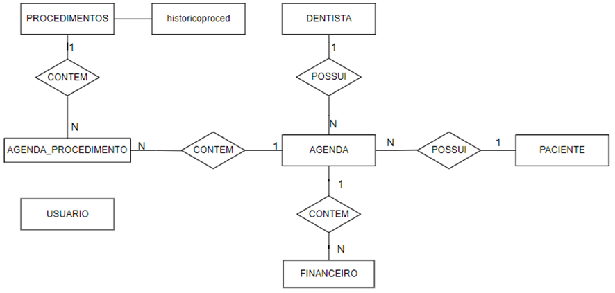
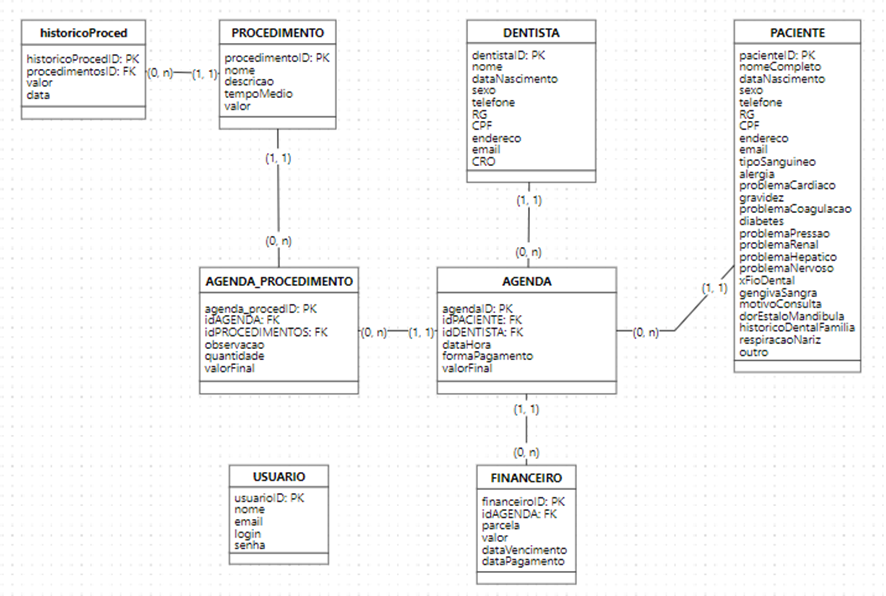

# Sistema de Cadastro e Agendamento - Clínica J&P

## Descrição do Projeto

Este projeto é um sistema básico de **cadastro** e **agendamento** desenvolvido para uma clínica odontológica. Ele gerencia **dentistas**, **pacientes**, **usuários** e **procedimentos** realizados durante as consultas. Atualmente, o sistema está em uma fase inicial de desenvolvimento, com várias funcionalidades mais avançadas planejadas para futuras atualizações.

**Observação:** A navegação do sistema opera de forma otimizada apenas a partir do arquivo `index.html`. Caso seja acessada diretamente através de pastas específicas no endpoint, pode ocorrer o risco de falha no carregamento da página. Para garantir o funcionamento correto, navegue através do caminho fornecido no `index.html`.

## Funcionalidades

Atualmente, o sistema oferece as seguintes funcionalidades:

- **Cadastro de Dentistas**: Armazenamento de informações como nome, RG, CPF, CRO e dados de contato.
- **Cadastro de Pacientes**: Coleta de dados pessoais, como nome completo, data de nascimento, condições médicas e outros detalhes relevantes.
- **Cadastro de Usuários**: Registro de nome, e-mail, login e senha para acesso ao sistema.
- **Agendamento de Consultas**: Gestão de consultas entre pacientes e dentistas, com seleção de procedimentos a serem realizados e forma de pagamento.
- **Relatórios Básicos**: Geração de relatórios sobre os agendamentos e cadastros realizados, proporcionando uma visão geral das operações.

## Tecnologias Utilizadas

- **PHP**: Responsável pela lógica de back-end e manipulação de dados.
- **MySQL**: Banco de dados relacional para armazenamento de informações de pacientes, dentistas, usuários, agendamentos e procedimentos.
- **HTML5 e CSS3**: Utilizados para criar a interface gráfica do usuário e garantir um layout responsivo.
- **XAMPP**: Ambiente de desenvolvimento que integra servidor web e banco de dados MySQL localmente.
- **phpMyAdmin**: Ferramenta para gerenciamento do banco de dados MySQL.

## Estrutura do Projeto

- **/cadastros**: Diretório contendo as páginas de cadastro e agendamento de dentistas, pacientes e procedimentos.
- **/conexao.php**: Arquivo para gerenciamento da conexão com o banco de dados MySQL.
- **/icons**: Diretório que armazena ícones utilizados na interface gráfica.
- **/relatorio**: Diretório responsável pela geração de relatórios simples sobre agendamentos e dados cadastrados.

## Diagramas

- **Diagrama DER**: Abaixo está o diagrama entidade-relacionamento (DER) representando as tabelas e seus relacionamentos no banco de dados:

  

- **Esquema do Banco de Dados**: Esquema visual do banco de dados utilizado no sistema:

  

---
